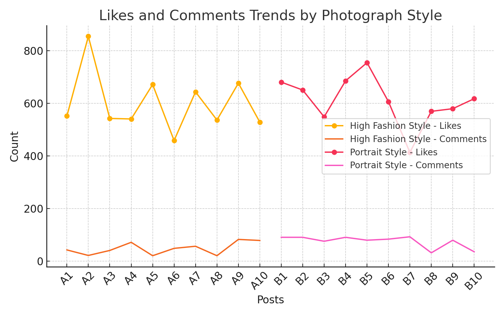
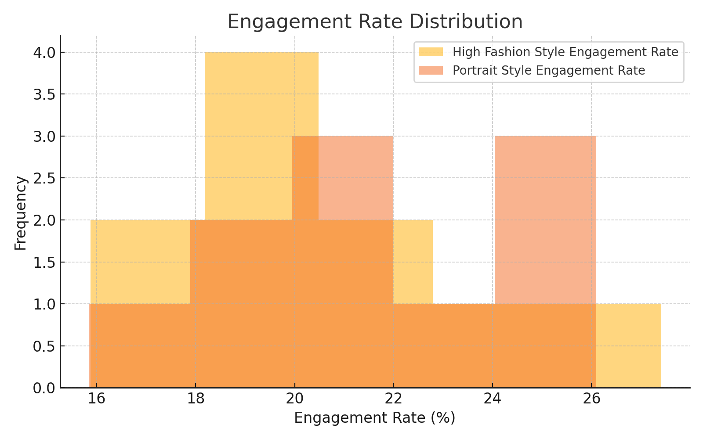

# Instagram A/B Test Study

## Objective
This project analyzes the engagement rates of two different photograph styles on Instagram: **High Fashion Style** and **Portrait Style**.

## Data
The dataset includes:
- **Likes**: Number of likes on a post.
- **Comments**: Number of comments on a post.
- **Engagement Rate**: Calculated as `[(Likes + Comments) / Followers] * 100`.
- **Impressions**: Total views for each post.
- **Saves**: Number of saves for each post.

## Analysis
- Conducted a t-test to assess the statistical significance of engagement rate differences between the two styles.
- Visualized engagement rates to highlight trends.

## Results
- **T-statistic**: -0.80
- **P-value**: 0.4369 (not statistically significant)
- Visualizations include:
  - **Likes and Comments Trends**: Line plot comparing trends across posts.
  - **Engagement Rate Distribution**: Histogram showing frequency distribution.
  - **Impressions vs Saves Scatter Plot**: Illustrates the relationship between impressions and saves.

## Detailed Visualizations
### Likes and Comments Trends

### Engagement Rate Distribution

### Impressions vs Saves Scatter Plot

## How to Use
1. Load the dataset (`ab_test_data.csv`) and script (`updated_ab_test_analysis.py`).
2. Run the script to replicate the analysis and generate visualizations.
